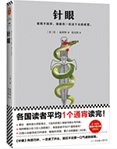

18年的不足是没有对每一本读过的书作详细的笔记，以至于很多故事情节现在回想起来，略有模糊。19年做些改变，每次的读书都将读后感和读书笔记进行记录，方便日后的记忆。

《针眼》这本书是肯福莱特六本二战悬疑经典中的第二本，第一本《大黄蜂》已在18年读完。全书围绕着主人公德国最优秀的一面间谍费伯而展开的狡猾与欺骗的较量。

来自德国的韦伯，代号“针”，发现了英国谋划四年的最大的秘密，这个秘密决定着盟国在战局上能否反败为胜。韦伯天生的不信任，足智多谋，冷漠无情，傲慢，天资聪颖，以及血液中流淌的极其优秀的普鲁士家族血液，决定了他在德国的地位。当英国高层发现了这样的人物，请出著名的历史学家高得里曼作为业余的反间谍高层领导，进行对“针”的追捕。两个人物的较量也代表了英国和德国高层较量。

韦伯是希特勒最为信任之人，是高得里曼最为痛恨之人。他成为战时扭转乾坤的极其重要的一个人物。希特勒的远见也最终需要得到他重量级的情报才能够得以实施。高得里曼和韦伯的不期而遇，以及后来的暗中角逐，让故事情节极其具有悬疑色彩，扣人心弦。

书中的人物韦伯和露西给我的印象最深，因为是战时，两个人代表了两个国家，即使有感情，却不得不去为国家而战，为了国家，只能有一人存活。面对残酷的现实，极其优秀的两个人只能将个人感情抛向一边。露西的丈夫大卫作为一名飞行员一心想要报效祖国，抛洒一腔热血，期待着有一天能开着自己的“风筝”（飞机）将德国敌机彻底击落。然而，新婚的当天再去赴任的路上，因为一场车祸，失去双腿变成残疾，从而彻底与战争无缘，只能带着妻子露西在小岛上安然度日。露西四年的不离不弃，哪怕大卫每次对她冷嘲热讽，哪怕大卫四年期间不与露西有任何亲密，露西依然将最好的爱给予丈夫和孩子。但露西也有心灰意冷的时刻，直到遇到了韦伯，发生了婚外情，于道德这种是会被嗤之以鼻，但依人性去反思这种结果，却值得深思。大卫最终发现了韦伯的身份，困在岛上四年之间无处伸展的报复在此刻得意爆发，如果能够亲手杀掉这名德国间谍，那么哪怕拖着残疾的双腿，他也能够高抬起头骄傲的展示自己的为战争作出的贡献。

然而韦伯之所以能存活到那时也是靠着他的坚韧，冷漠，机智，警惕以及决绝。两个人的力量是有悬殊，大卫不幸牺牲，但大卫自始至终都是极其勇敢的。当露西得知自己的丈夫被自己爱上的人杀死，又将电台新闻中听到的消息和自己多日来的观察的细节，像拼图一样，一一拼接起来了，杀人犯，渔船，暴风雨，照片底片等等，发现了韦伯是名德国间谍。她遏制了自己的情感最终靠着自己的勇气和智慧杀死了韦伯。这一幕又让去小岛营救的军情五处高级长官布劳格斯发现，因失去自己的爱妻，而常年处在单身生活中的他，本以为再也遇不到和爱妻一样的女英雄了，然而看到窗户紧盯的木板，砍掉的栏杆，死去的牧羊犬，以及死去的皇家观察员汤姆，砍掉的韦伯的两只手指头，此刻却被露西深深打动了，他想，他又遇到了一名最棒的女英雄，从此两个人过上了幸福的生活。而盟国通过狡猾和欺骗战胜了不可一世的德国。

看完这本书，会幻想，假如韦伯不是德国间谍，假如露西也没有嫁给大卫，两个人是不是会在和平时期成为一对非常完美的恋人。然而，命运弄人，露西却和布劳格斯经历了一个美满幸福的下半生。间接也说明，相爱并深爱并不一定能够在一起，或许合适并互相欣赏才能够长久吧。

战争会抹杀爱情，会滋生革命友谊，就像高得里曼和布劳格斯一样，但也会让人更冷酷更无情，就像韦伯。韦伯的牺牲，不在于英国反间谍的强大，而在于自己唯一唯一一次的打破原则去犹豫了，一贯的冷漠却被犹豫代替，没有立刻杀死露西。或许这也是爱情的一部分吧，谁知道呢，也许大家都没有错，错在不该有战争。

