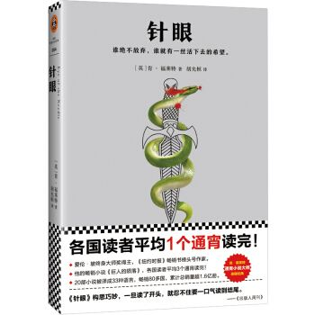
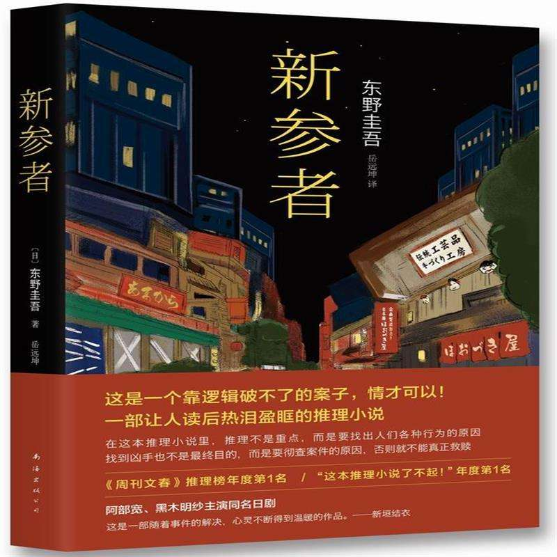
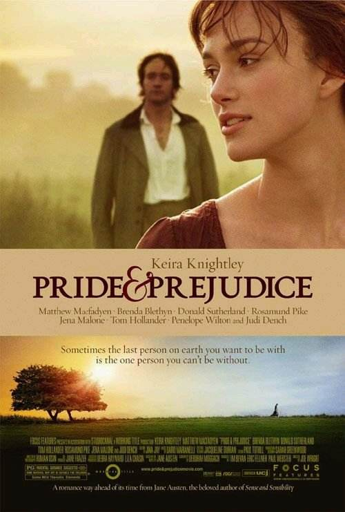
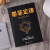

# 1、第一本《针眼》

### 英文书名：`Eye of the Needle`
### 作者：[英]肯·福莱特

# 2、第二本《莫斯科绅士》

### 英文书名：`A Gentleman in Moscow`
### 作者：[美]埃默·托尔斯 

# 3、第三本《无声告白》

### 英文书名:`Everything I Never Told You`
### 作者：伍绮诗

#### 我们终此一生，就是要摆脱他人的期待，找到真正的自己

# 4、第四本《了不起的盖茨比》

### 英文书名：`The Great Gatsby`
### 作者： 菲茨杰拉德 

# 5、第五本《新参者》

### 作者：[日]东野圭吾 

# 6、第六本《傲慢与偏见》

### 英文书名：`Pride and Prejudice`
### 作者： [英]简·奥斯丁 

# 7、第七本《局外人》

### 英文书名：` L'Etranger`
### 作者： [法] 阿尔贝·加缪  

# 8、第八本《墨菲定律》

### 英文书名：` Murphy's law`
### 作者： 李原  

# 9、第九本《浪潮之巅（上册）》

# 10、第十本《浪潮之巅（下册）》

阅读中。。。

# 11、第十一本《The Elements of Data Analytic Style》

阅读中。。。