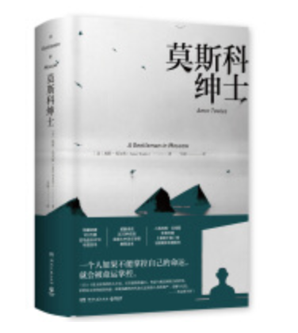

耗时一个月将这本书读完，应该算是边旅行边完成的阅读计划。

刚开始阅读时，感觉像是描述一个前时代“人民”的经历，处处充满了历史故事，详细记录了这名高贵伯爵生活起居，即使身陷泥沼，也会坦然优雅，桃源终究是自己给自己造。然而，最后的部分却画风一转，隐忍多年，曾经看似平常的细节，却在最后都串联起来，设计了一个完美的局，终究圆了自己的归乡梦。

书中每个人物都有后续，都为最后的结果做了铺垫。都对罗斯托夫伯爵的人生产生了蝴蝶效应。罗斯托夫伯爵应该是俄罗斯那段历史中最幸福的人。失去自由，却收获了亲情爱情友情，并拥有极其自律坚韧果断决绝的性格和明确的目标与方向。

	事实证明，只要一个人生活的方方面面都朝着他所期待的方向发生改变，那么他便可以幸福地回首往事或重返故地。
		--- 摘自《莫斯科绅士》
		

到了最后的最后，时代是不会对有梦之人有影响的，唯一的、亘古不变缠绕在人周围的就是时间了。

附经典语句：

1. 国王用城堡使自己强大，绅士则用书桌；
2. 可是有一种经验却是我们不太能学到的，那便是：如何与最心爱的东西告别。即使有学习的机会，我们也宁可对之退避三舍；
3. 我们将心爱之物抓得比最要好的朋友更紧。不管去哪儿都会带上它们，不惜为此承担不菲的费用，忍受诸般不便；我们不忘时时替它们弹除灰尘，训斥它们近旁玩耍得太疯的孩子们；任由与它们相关的回忆不断为它们添加更多价值。
4. 人生中的逆境会以许多不同的方式出现，假如一个人不能掌控自己的命运，他就会被命运掌控。
5. 当皇帝被人从御阶上拖下来扔到大街上，奢华会卑谦地底下它的头。然而，经过长期的隐忍，它又会替新上台的领袖披上华丽的外衣，赞美他高贵的外表，并建议他多佩戴几枚勋章。
6. 由平民百姓组成的士兵能用胜利的烈火将旧政权的旗帜烧的干干净净，号角很快便会重新吹响，奢华又会在权利宝座一旁重新就位。它对历史和君主们的统驭又将重新奠定。
7. 幸福的家庭都是相似的，不幸的家庭各有各的不幸；
8. 在青春期的我们看来，年幼时那些几乎被我们遗忘的日子根本不值一提；而成年以后，我们也只会偶尔回忆起它们。但其实，我们一辈子都逃不开它们的束缚和支配。
9. 尽管生活中美丽季节的变迁和缤纷的节庆已被日复一日毫无差别的生活所取代，但那些被软禁的人仍知道要在木头上或者监狱的墙壁上刻下三百六十五道凹痕。
10. 如果专注力是用分钟，自制力是用小时来衡量的话，那么毅力则是用年来衡量的。
11. 如果耐心那么容易就能经受住考验的话，它也就谈不上是什么美德了。
12. 那些让我们难以企及的事物反而会得到我们最多的关注。
13. 这些被流放的人比任何一个自由自在地享受着莫斯科生活的当地居民，都要向往这座城市的辉煌。
14. 永远都要发光，照亮你所到的每一个地方，直到你生命中的最后一刻。
15. 当生活处在动荡之中时，即使躺在舒适的床上，我们也会因为或大或小，或真实或虚幻的担忧感到惶惶不安。
16. 每个国家都与它自己的传世名画，就是那些被世世代代悬挂在庄严的大厅内，能代表民族身份的画作。法国人有德拉克洛瓦的《自由引导人民》，荷兰人有伦勃朗的《夜巡》，美国人则有《华盛顿横渡特拉华河》。
17. 音乐片不过是“用根本无法实现的白日梦来安抚穷苦大众的一盘糕点”。
18. 恐怖电影则“使的是障眼法，它不过是把劳动者的恐惧用漂亮女人的恐惧来替代了”。
19. 俄罗斯历史上有那么一小段错位的时期；那些宏伟的古老建筑被摧毁必然会引起少数人对过去的惋惜，同时也会唤起一些人对未来的殷切期盼；但当一切已被言说并完成时，我不禁认为，那些伟大的事物能够永存。
20. 人类的谋略从来都逃不出偶然，犹豫和轻率的巢穴。
21. 如果说沉静是成熟的标志，那冲动则是青春的标志才对。
22. 一个人想要开拓自己的眼界，就要敢于到超出自己眼界的地方去冒险。
23. 因为在生活中，真正重要的并不是我们能否获得一轮又一轮的喝彩声，而是在面对这种荣誉的不确定性时，我们是否仍然敢于鼓起勇气前进。
24. 生活从来都不是跳跃着向前推进，而是逐渐展现的。在某个特殊的时刻，这些成千上万的细微变化才开始显露出来。我们的能力会此消彼长，我们的经验会越攒越多，我们的观点和认识也会不断改变（即使不是极其缓慢地，至少也是逐渐改变的）。
25. 伯爵最后只给了索菲亚两条最简洁的忠告：第一，假如你不去掌控形势，你就会被形势掌控；第二条则是蒙田的一句名言“一个人是否有智慧，最可靠的标志就是看他是不是总是很快乐”。
26. 一个人即将第一次出国旅行时，最不愿听到的就是没完没了的叮嘱，严肃而沉重的忠告，还有，就是涕泪涟涟的离情别意。就像记忆中那碗简单而普通的汤一样，当一个人想家的时候，他最容易想起，同时最让他觉得舒心的，反而是那些被讲过上千遍的小趣事。
27. 那些年轻时在学校遇到过困难或交不到知心朋友的人，见别人活得轻松惬意时，都会投以怀恨的目光。
28. 我们所有人的生活都被不确定的因素控制着，而这些因素中，很多都具有破坏性，甚至极其可怕；但只要我们坚持，保持宽容大度的心态，我们便有可能等来大彻大悟的那个时刻，而在那一刻，所有曾经发生在我们身上的事都会突然变得无比清晰，原来它们中的每一件都是人生中必不可少的部分，即便我们即将踏入期盼已久的生活，也同样是如此。
29. 假如你有一个曾经珍爱的地方，而且你有数十年都没有回去过了，那么智者一定会劝你永远不要回到那儿去。
30. 在饱受了多年的思乡之苦后，这些旅居者为什么刚回到家，又那么快地弃家而去呢？其中的原因很难讲清。也许对离家多年又回来的那些人来说，对故乡的深厚感情和时间造就的无情变化结合在一起，给人带来的只能是失望。风景不再像记忆中那般美丽。苹果酒也不如昔日那般香甜。古老的建筑经过重修已面目全非，古老的习俗和传统也已经渐渐失传，取而代之的则是令人费解的新的娱乐方式。你心里想着自己好歹也在这一小片天地里住过那么多年，但如今，这里却几乎没人认识你，甚至根本不会有人认识你。因此，智者才会忠告你：离你古老的家园越远越好。
31. 只要一个人生活中的方方面面都朝着他所期待的方向发生着改变，那么他便可以幸福地回首往事或重返故地。

一直在思考为何读书，比如此次旅行中，结合着读书的过程，会有不同的体验，更多的是了解其他的社会生活和民俗风情。

因为自律和性格坚毅让自己逐渐美好，而莫斯科绅士让我明白什么是绝对的自律和绝对的高贵以及绝对的沉着冷静从容不迫，它无关物质，关乎精神。

而又因为踏出国界才发现这个世界如此多的人生活在贫困线，并且有更多的女性还未能完全解放，依然是延续传统，不被允许出门工作，更不允许在婚后随便出门，斯里兰卡这个依然还是大部分以男性为主导的国家，让我感觉到自己生在祖国，作为一名女性能够独立自主的决定自己的命运，感到如何的幸运和满足。

在锡兰，更多的被问及年龄，职业，很多人都用反问句，比如“你是不是24，25岁？”“你是20岁么？”“你是不是学生？”“你真的好漂亮！”“我可以跟你合个影吗？”“很多中国人都很急躁，都在赶时间，可我发现你做事情都比较慢，一点都不急躁”“你的英语很棒啊，很多中国人都不能用说英语”。

在自己经历了这些之后，感觉自己活出了成果，逐渐提升的英语水平，一副看不出年龄的面容，一个平和稳重的性格，一个阳光乐观积极的心态～

2019年会更好！
