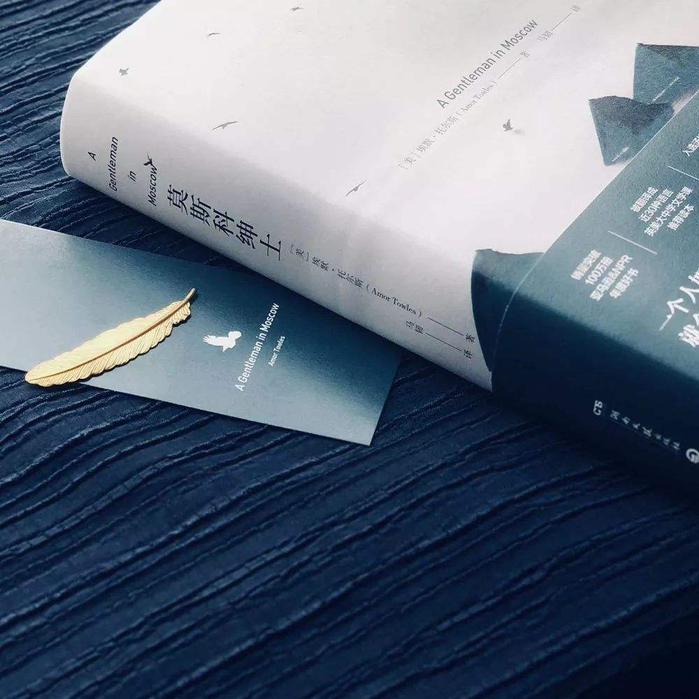
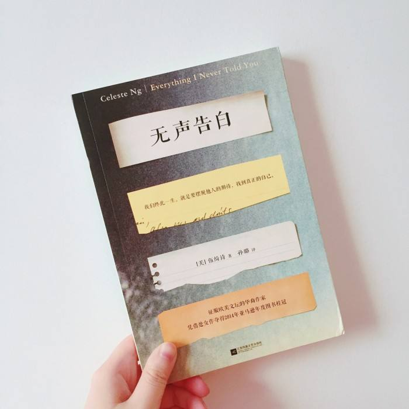
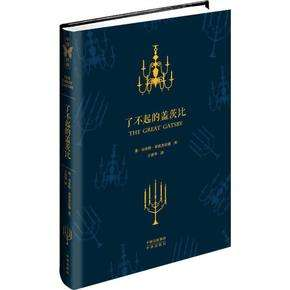
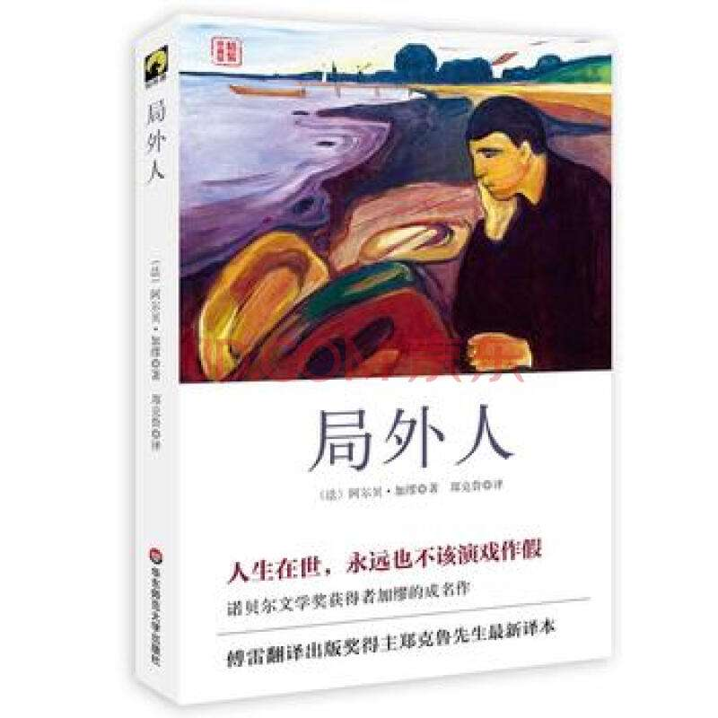

# 1、《针眼》

### 英文书名：`Eye of the Needle`
### 作者：[英]肯·福莱特

臣服于针这个人物的冷血，聪慧，睿智，近乎完美的人却最终败在了人生仅有的一次感情用事上，代价却是生命。

# 2、《莫斯科绅士》

### 英文书名：`A Gentleman in Moscow`
### 作者：[美]埃默·托尔斯 

一个高贵落寞永久失去自由的绅士用半生时间诠释自由是最可贵难得的财富，从另一个角度也证明了自律、严禁、思想、谨言慎行品质给人生带来的巨大意义。

# 3、《无声告白》

### 英文书名:`Everything I Never Told You`
### 作者：伍绮诗

我们终此一生，就是要摆脱他人的期待，找到真正的自己

# 4、《了不起的盖茨比》

### 英文书名：`The Great Gatsby`
### 作者： 菲茨杰拉德 

患难见真情，永远和金钱无关。相信感情会让你拥有所有，也会让你一无所有，取决于你相爱的那个人的品性。

# 5、《新参者》

### 作者：[日]东野圭吾 

不及时记笔记的缺点，导致具体情节以及无法清楚的回忆起。但一点足以铭记在心，细节决定成败。

# 6、《傲慢与偏见》

### 英文书名：`Pride and Prejudice`
### 作者： [英]简·奥斯丁 

挑战世俗理念，追求恋爱平等和思想的共鸣。灵魂契合的人更能成为永久而幸福的伴侣。

# 7、《局外人》

### 英文书名：` L'Etranger`
### 作者： [法] 阿尔贝·加缪  

随置身事外，却无意识处处深陷其中，成为社会的牺牲品。

# 8、《墨菲定律》

### 英文书名：` Murphy's law`
### 作者： 李原  

遵守人生特定的规律和准则，让生命更有特色和色彩

# 9、《浪潮之巅（上册）》

科技巨头的潮起潮落

# 10、《漫长的告别》

活在父母的期望中，却没有活出自己

# 11、《浪潮之巅下册》

优秀企业的成长方式和理念

# 12、《我和连岳一起成长》

# 13、《扫地出门--美国城市的贫穷与暴利》

一本美国中产阶级一下弱势群体的生活方式

# 14、《活出生命的意义》

奥斯维辛集中营逃脱出后的重生。心理学的一次升华

# 15、《房思琪的初恋乐园》

只为主人公的亲身经历来阅读此书，换句话说，真正杀死她的，不是老师，而是这个社会和家人。生理教育同智力教育或者心理教育同等重要。单纯的禁止这些行为，犹如掩耳盗铃。唯有家长或社会正确的去面对和引导未成年的一些行为，方能减少无畏的伤害，更能在伤害假使发生时，以正确的方式和心理去应对。

# 16、《机器人总动员》英文版

今年读完的第一本英文书吧，再接再厉

# 17、《无人生还》

绝对堪称挑战智商到极限的一本书，不读到最后，真心以为是鬼神在作怪。难怪豆瓣评分相当之高。

# 18、《塔木德》

犹太人人手一本的“圣经”，一部传世之作，为人处世和经商之道的典范。最具商业价值的当属诚信。无诚信，举步维艰。

# 19、《掌控》

一部人际关系的理论鸡汤。还可以吧。有些经典案例可以参考，比如总统约翰逊生平经历，可以作为一个教材，不放弃理想时刻准备的重要性。

# 20、《乔布斯传》

一部作为技术人员更应该阅读的一本书。读前只懂得字面“化繁为简，至繁归于至简”，读后才能领略精髓。一个伟大的企业为何能够创造出改变出世界的产品，看似偶然却实际处处透露出必然。

你所不关注不在乎的细节，正是别人打败并取代你的关键。

# 21、《见识》

一个人能走多远，取决于她的见识。

一个人格局能有多大，也取决于她的见识。

创造未知，才有一切可能。

# 22、《爱玛》

一本写给单身女性的书籍。

所谓势均力敌门当户对，你找到的那个人终究代表的相同水平的你。改变可以改变的，优秀的你应该和同样优秀的另一半组建家庭。与其将就不如耐心去提升自己，待他出现时，才不至于惊慌失措。遇到了你，恰恰刚好

关于爱情，自己在今年重新相信了一见钟情，多少年来，唯一一个匹配自己一切美好愿望的一个阳光大boy。始于颜值，陷于才华，很可惜一切都不随人愿。。。暖暖的白羊先生提到：若你归来，你我都还单着，可以尝试。自己明知道虽然很难，但却依然是个美好的期盼。因为缺少身份，所以选择隐藏自己的想法，只希望未来真的能够不期而遇。本不应该在三十多岁的年纪去相信童话般的故事，可还是选择傻傻的期待了。

曾记得书里看到过这样一句话，只有双向的喜欢才值得等待。多么希望也能知道你也如我一般对你一见钟情，那么未来一切等待都将是值得的。就如爱玛和奈特利先生一样，持久的友情转化为爱情。可是三十多岁的年纪，在这个物欲横流、一切都如快餐般的生活节奏的环境下，这一切可能么？还有哪个男孩愿意真的等待

# 23、《JavaScript高级程序设计》

应试准备的一本书😆

# 24、《看得见的世界史-玛雅》

希望通过书本先了解知识，再未来旅行中，也能够身历其境时体验其文化和民俗

# 25、《人月神话》

计算机工程学的一本经典著作。深刻阐明了项目一而再再而三的拖延的根本原因，解释为何逐渐增加人力和项目完成的速度会成反比。一个项目为何不能持续存在并更新，逐年累月的人力变更和开发量，使内部结构逐渐庞大以及混乱，使得新项目替代旧项目的方案成为必要性。

# 26、《九型人格》

通过书中的性格的描写，找到了自己的定位，自我解读可能更好的进行自我和解。接纳自己的不足，用于去克服并改进，和不同类型的人相处更能理解其行为处事背后的动机。了解人的性格，也希望面对性格差异的时候，能够将冲突化为最小，拥有更多的理解和包容。

# 27、《看得见的世界史-古希腊》

# 28、《异类》

副标题：不一样的成功启示录

# 29、《FBI读心术》

一本偏大众的读物，很多理论比较教条化，干活不多。感觉可吸收的东西不是很多。

# 30、第十一本《The Elements of Data Analytic Style》

略去。